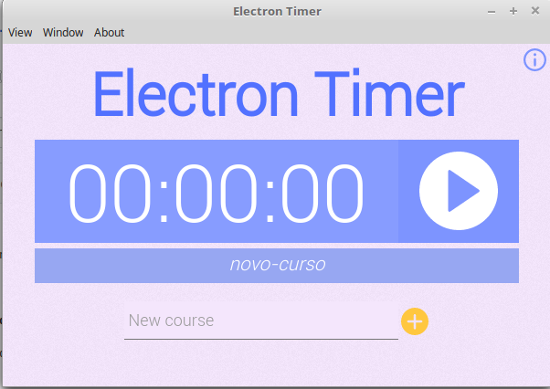

# Electron-Timer
A Timer Developed in Electron.  



## Get Started Immediately

First, install all dependencies with the following command:

```sh
yarn install
```

start the application:

```sh
yarn start
```

**Happy Hacking** :tada:.
